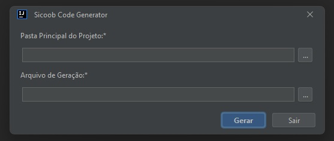

# Plugin Gerador de API Java Spring - CodeGenerator
Este plugin é um gerador de código Java para o Sicoob que permite criar as camadas dos objetos de maneira rápida e eficiente. Ele gera automaticamente as entidades, repositórios, serviços, implementações de serviço e repositórios.

## A definição de entidades segue a seguinte sintaxe de objetos:

#### Envio completo:


```java
public class RequestDTO {
  private List<TableDTO> tables;
}
```

```json
{
  "tables": [
    {
      "table": "Cachorro",
      "columns": [
        {
          "name": "id",
          "type": "UUID",
          "primaryKey": true
        },
        {
          "name": "nome",
          "type": "String"
        }
      ]
    }
  ]
}
```

### Sintaxe de definição de entidades

```java
public class TableDTO {
    private String table;
    private List<ColumnDTO> columns;
}
```

```java
public class ColumnDTO {
    private String name;
    private String type;
    private Integer length;
    private boolean primaryKey;
    private boolean required;
    private boolean updatable;
    private boolean list;
    private boolean unique;
    private String generationType;
    private String cardinality;
}
```

`table:` Nome da entidade (deve ser camelCase e iniciar com letra Maiúscula).

`name:` Nome da coluna (deve ser camelCase). No banco de dados, será convertido para snake_case, seguindo as boas práticas de nomenclatura de banco.

`type:` Tipo da coluna (deve ser o exato nome da propriedade/objeto, como String, Integer, Venda, etc.).

`primaryKey (opcional):` Indica que a coluna será a chave primária da entidade.

`required (opcional):` Indica que a coluna é obrigatória ao cadastrar. Será adicionada a anotação `@NotNull` no DTO de persistência para garantir que o usuário informe o valor.

`list (opcional):` Indica que a coluna será uma lista.

`updatable (opcional):` Indica que a coluna pode ser atualizada. Será criado um DTO específico para atualização. Caso nenhuma propriedade possa ser atualizada, o DTO e o método de atualização correspondente não serão gerados.

`generationType (opcional, case insensitive):` Indica o tipo de geração da coluna que contém a anotação `@GeneratedValue`. Pode ser um dos seguintes valores: `OneToMany`, `ManyToOne`, `OneToOne`, `ManyToMany`.

`cardinality (opcional, case insensitive):` Indica o tipo de cardinalidade da coluna. Pode ser um dos seguintes valores: `Table`, `Sequence`, `Identity`, `UUID`, `Auto`.

### Como utilizar
Para utilizar o gerador, siga as etapas abaixo:

1- Instale o Plugin

2- Na IDE, aperte o atalho `Ctrl + Alt + G`, abrirá a seguinte modal para configuração




3 - Faça as personalizações adicionais necessárias para atender aos requisitos específicos do seu projeto e clique em `Gerar`.

4- Uma breve explicação dos campos:
- `Pasta Principal do Projeto:` Pasta onde os arquivos e pastas serão criados (Pasta pai do projeto)
- `Arquivo de Geração:` Arquivo que contém as entidades a serem geradas seguindo a nomenclatura citada (`JSON`)

### Observações

- Após a geração do código, faça as devidas personalizações para atender aos requisitos específicos do seu projeto.

- É recomendável revisar e testar o código gerado para garantir que tudo esteja funcionando corretamente.
